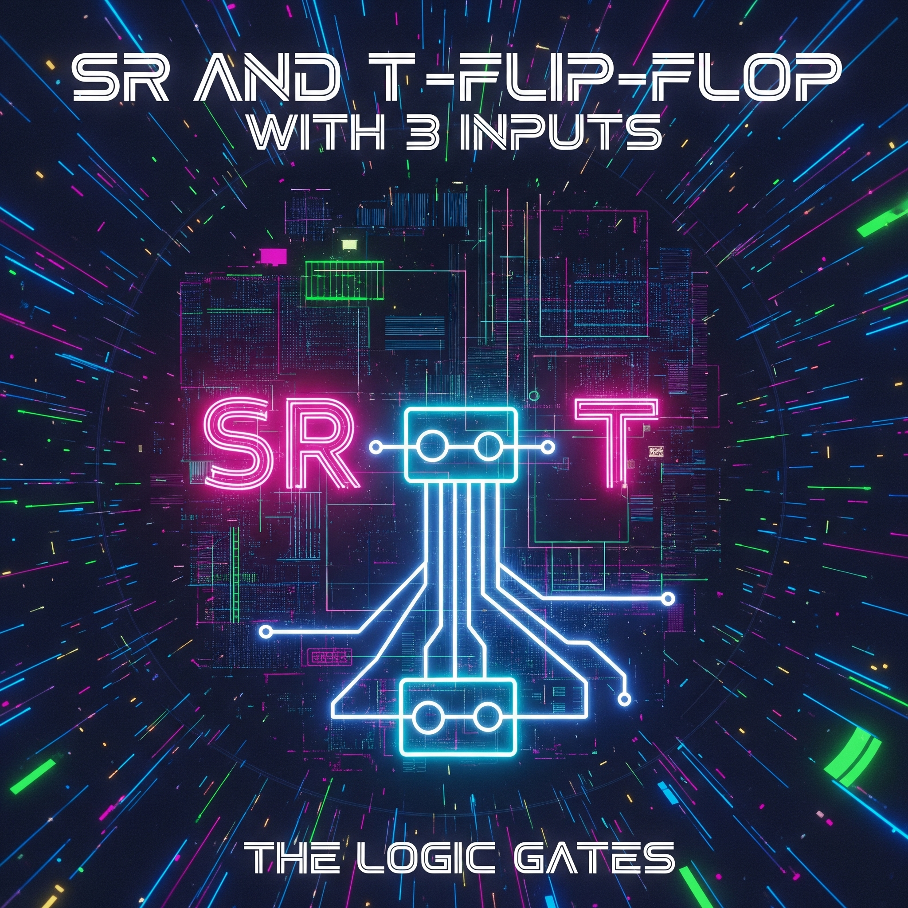
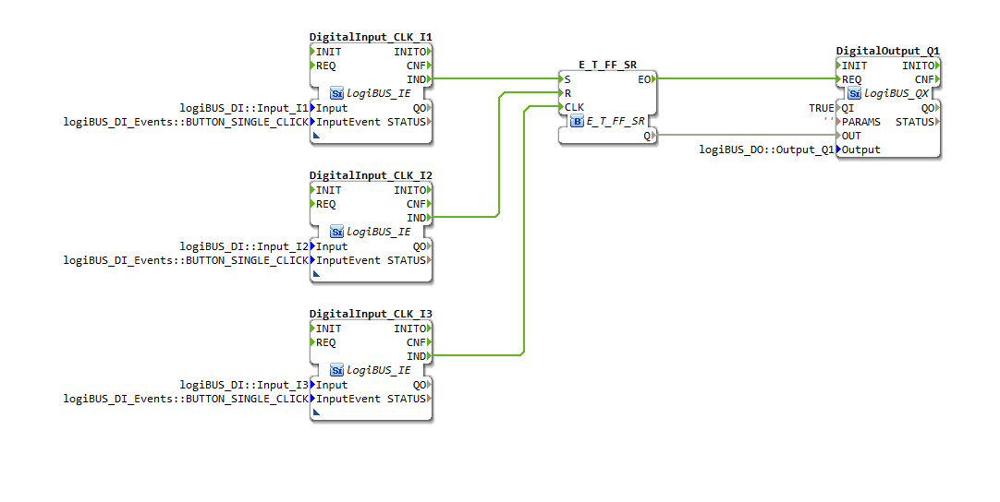

# **Übung 006a: SR- und T-Flip-Flop mit 3 Eingängen**

[Uebung_006a](https://docs.ms-muc-docs.de/projects/visual-programming-languages-docs/de/latest/training1/Ventilsteuerung/4diacIDE-workspace/test/FBs/Uebungen/Uebung_006a.html)

Dieser Artikel beschreibt die technische Umsetzung und Funktionsweise der "Übung 006a", die ein SR- und T-Flip-Flop unter Verwendung von drei digitalen Eingängen (`logiBUS_IE`) realisiert.

## Podcast
<iframe src="https://creators.spotify.com/pod/profile/logibus/embed/episodes/Digitaltechnik-entschlsselt-Das-Geheimnis-des-SR-T-Flip-Flops-mit-drei-Tasten-e36vkub/a-ac3v9pl" height="102px" width="400px" frameborder="0" scrolling="no"></iframe>

----

## **Übersicht**

| **Name** | **Beschreibung** |
| :--- | :--- |
| **Typ** | Sub-Applikation |
| **Name** | Uebung_006a |
| **Kommentar** | SR und T-Flip-Flop mit 3x IE |
| **Autor** | Franz Höpfinger |
| **Datum** | 23. Oktober 2023 |
| **Organisation** | Meisterschulen am Ostbahnhof |

---

## **Komponenten und Aufbau**

Die Schaltung besteht aus fünf Hauptkomponenten: drei digitalen Eingangsblöcken, einem Funktionsblock, der die Flip-Flop-Logik kapselt, und einem digitalen Ausgangsblock.

* **Drei Digitale Eingänge (FB: `logiBUS_IE`)**:
    * `DigitalInput_CLK_I1`: Dient als **Setz-Eingang (S)**.
    * `DigitalInput_CLK_I2`: Dient als **Rücksetz-Eingang (R)**.
    * `DigitalInput_CLK_I3`: Dient als **Takt-Eingang (CLK)** für die T-Flip-Flop-Funktionalität.
    * [cite_start]Alle drei Eingänge sind so konfiguriert, dass sie bei einem einfachen Klick (`BUTTON_SINGLE_CLICK`) ein Ereignis auslösen[cite: 1, 2].

* **Flip-Flop-Logik (FB: `E_T_FF_SR`)**:
    * Dies ist der zentrale Logikbaustein, der die Signale von den drei Eingängen empfängt und basierend auf seiner internen Logik den Ausgang steuert. Er kombiniert die Funktionalität eines SR-Flip-Flops mit der eines T-Flip-Flops.

* **Ein Digitaler Ausgang (FB: `logiBUS_QX`)**:
    * [cite_start]`DigitalOutput_Q1`: Stellt den Zustand des Flip-Flops (Q) dar und ist mit dem physischen Ausgang `logiBUS_DO::Output_Q1` verbunden[cite: 1].

---

## **Funktionsweise und Logik**

Die Logik der Schaltung wird durch die Verbindungen zwischen den Funktionsblöcken definiert.

### **Ereignisverbindungen (Event Connections)**

Die Ereignisverbindungen steuern, wann ein Funktionsblock aktiviert wird:

1.  [cite_start]**Setzen (S)**: Ein Ereignis am Eingang `DigitalInput_CLK_I1` (IND) löst den **S-Eingang** des `E_T_FF_SR`-Blocks aus[cite: 1]. Dadurch wird der Ausgang `Q` auf `TRUE` gesetzt.
2.  [cite_start]**Rücksetzen (R)**: Ein Ereignis am Eingang `DigitalInput_CLK_I2` (IND) löst den **R-Eingang** des `E_T_FF_SR`-Blocks aus[cite: 1]. Dies setzt den Ausgang `Q` auf `FALSE` zurück.
3.  [cite_start]**Toggeln (CLK)**: Ein Ereignis am Eingang `DigitalInput_CLK_I3` (IND) löst den **CLK-Eingang** des `E_T_FF_SR`-Blocks aus[cite: 1]. Dies bewirkt, dass der Ausgang `Q` seinen Zustand ändert (von `TRUE` auf `FALSE` und umgekehrt), ähnlich einem T-Flip-Flop.
4.  [cite_start]**Ausgangs-Ansteuerung**: Nach jeder Zustandsänderung sendet der `E_T_FF_SR`-Block ein Ereignis (von `EO` zu `REQ`) an den `DigitalOutput_Q1`, um den physischen Ausgang zu aktualisieren[cite: 1].

### **Datenverbindungen (Data Connections)**

Die Datenverbindung überträgt den logischen Zustand:

* [cite_start]Der Ausgang `Q` des `E_T_FF_SR`-Blocks ist direkt mit dem Eingang `OUT` des `DigitalOutput_Q1`-Blocks verbunden[cite: 1]. Dies bedeutet, dass der physische Ausgang Q1 immer den aktuellen logischen Zustand des Flip-Flops widerspiegelt.

---

## **Zusammenfassung der Funktionalität**

Zusammenfassend lässt sich die Funktionsweise wie folgt beschreiben:

* **Taste I1**: Setzt den Ausgang Q1 (schaltet ihn ein).
* **Taste I2**: Setzt den Ausgang Q1 zurück (schaltet ihn aus).
* **Taste I3**: Ändert den Zustand von Ausgang Q1 (toggelt ihn).