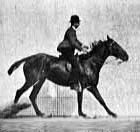

# Muybridge Horse Jumping

## Quelle

[https://upload.wikimedia.org/wikipedia/commons/6/62/Muybridge_horse_jumping_animated.gif](https://upload.wikimedia.org/wikipedia/commons/6/62/Muybridge_horse_jumping_animated.gif)

## Informationen und Lizenz

[https://de.wikipedia.org/wiki/Datei:Muybridge_horse_jumping_animated.gif](https://de.wikipedia.org/wiki/Datei:Muybridge_horse_jumping_animated.gif)

**Beschreibung:** Bildfolge eines springenden Pferdes. Serienfotografie von Eadweard Muybridge (gestorben 1904), erstmals veröffentlicht 1887 in Philadelphia unter dem Titel *Animal Locomotion*. Animation von Waugsberg, 7.10.2006.

**Urheber:** Eadweard Muybridge, Waugsberg

**Datum:** 1887 (Fotos), Animation 2006

**Lizenz:** Public Domain / Gemeinfrei – Creative Commons Public Domain Mark 1.0
